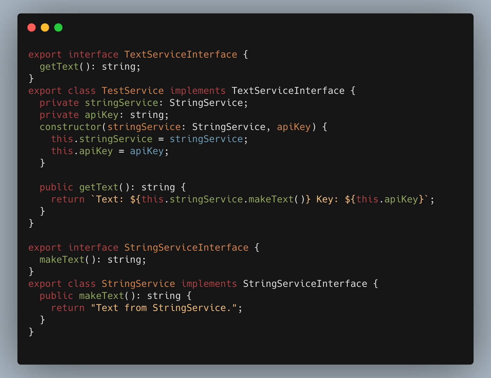
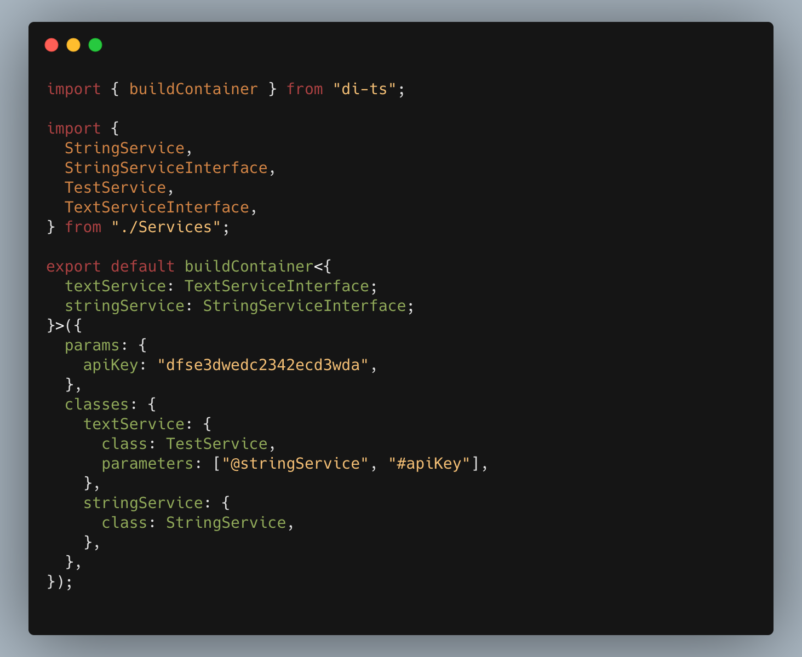
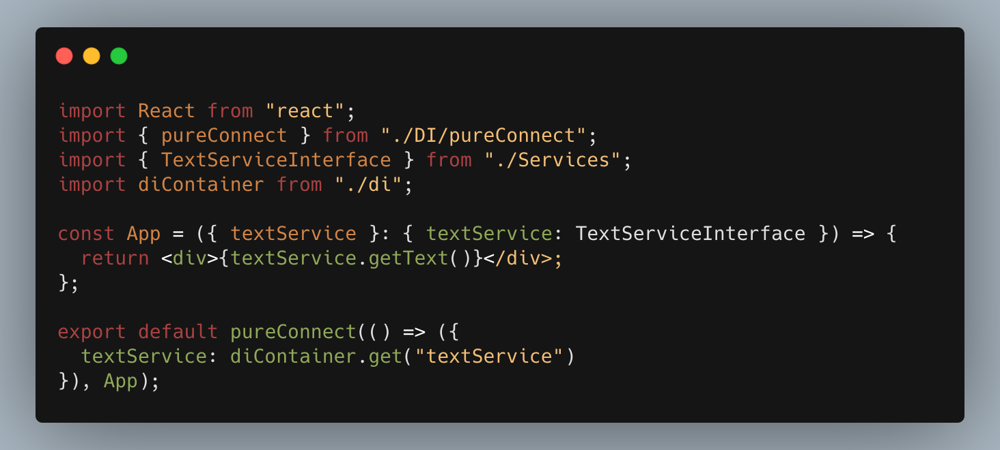

# Библиотека для внедрения Dependency Injection в фронтовые проекты

Для начала опишем простые, зависимые сервисы. C помощью DI мы сможем собирать такие сервисы автоматически.

Инициализируем конфигурация для зависимостей.
Дженериком можем передать нужные типы.

Поле `params` нужно для передачи глобальных параметров в DI контейнер.

Поле `classes` нужно для построения экземпляров классов. 
В параметрах могут быть указаны значения из поля `params` (#key) и другие зависимоcти (@key).

На выходе получаем типизированный DI контейнер.

Импортируем DI в клиентский код. И пытаемся получить собранный сервис по ключу.

DI работает! 

### В итоге используя данный инструмент мы получаем:
 - Уменьшение зависимостей в нашем коде. 
 - Мы можем типизировать сервисы как интерфейсы и без труда подменять их.
 - Конфигурирование DI контейнера находится в одном файле.
 - Типизация зависимостей.
